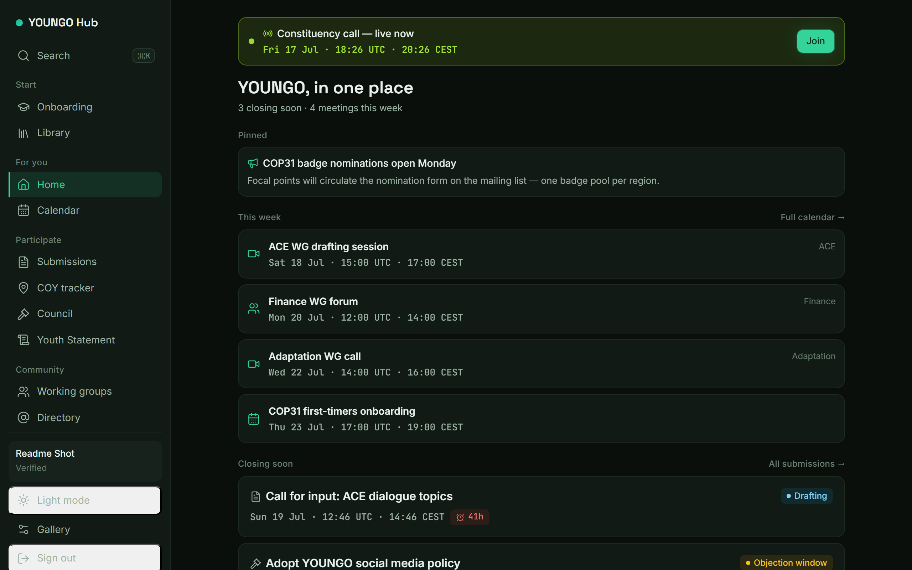
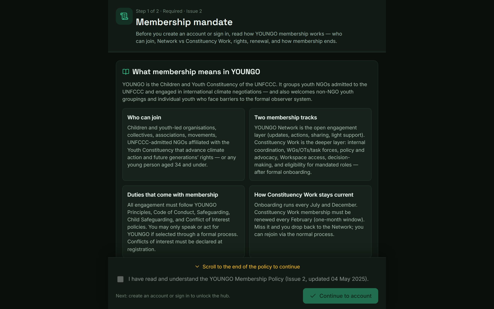
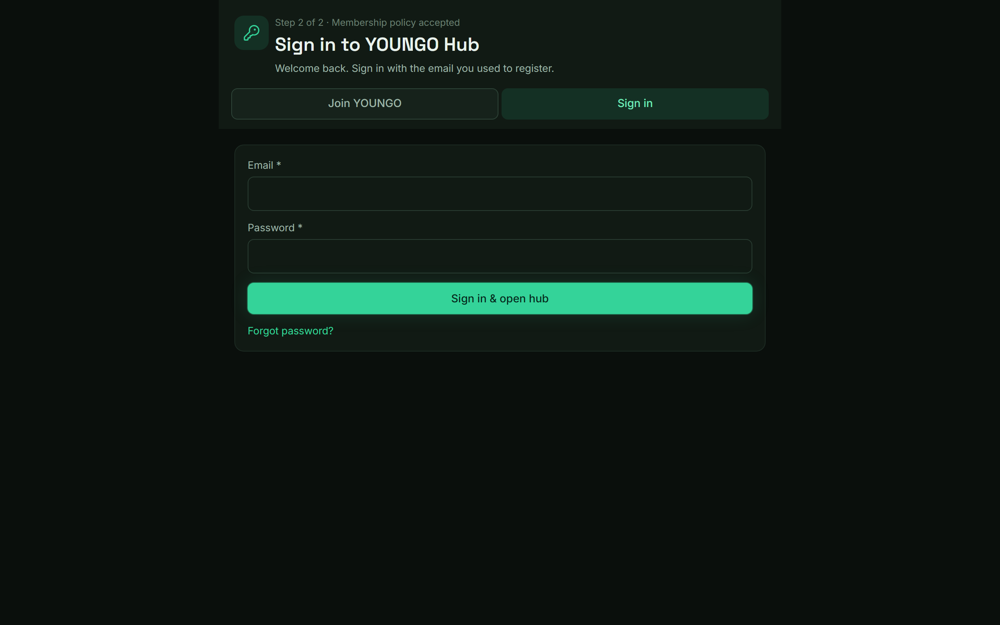
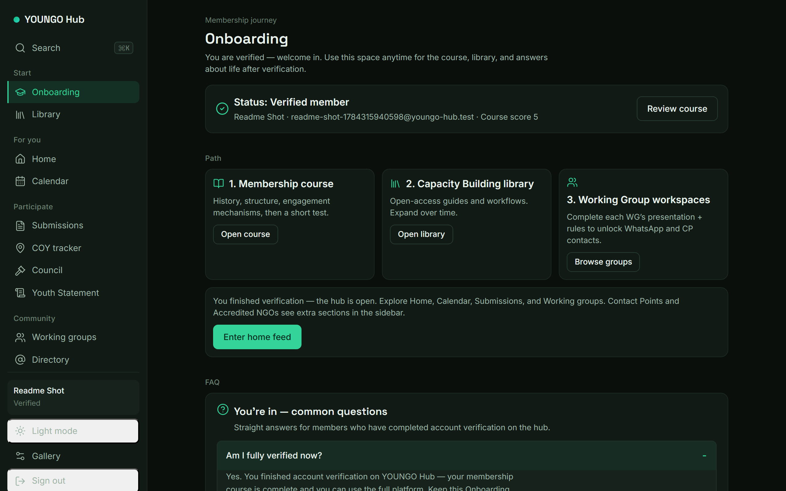
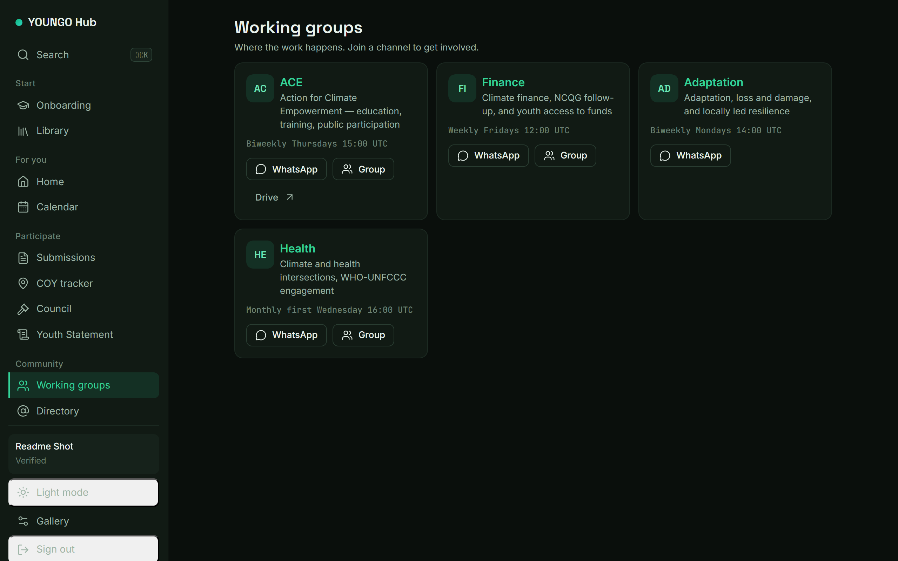
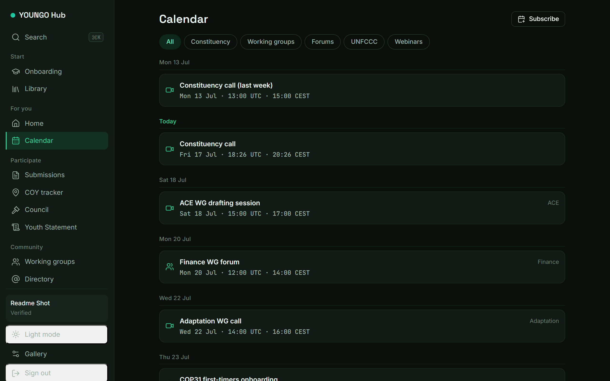
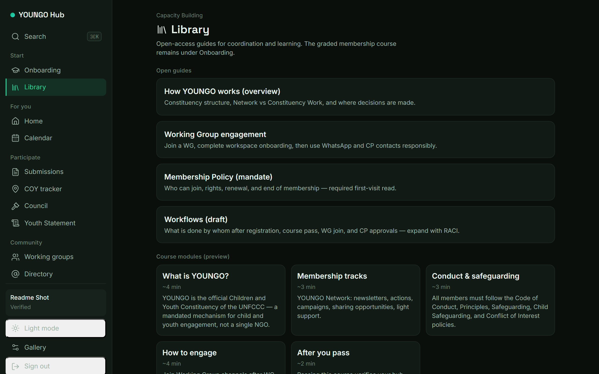
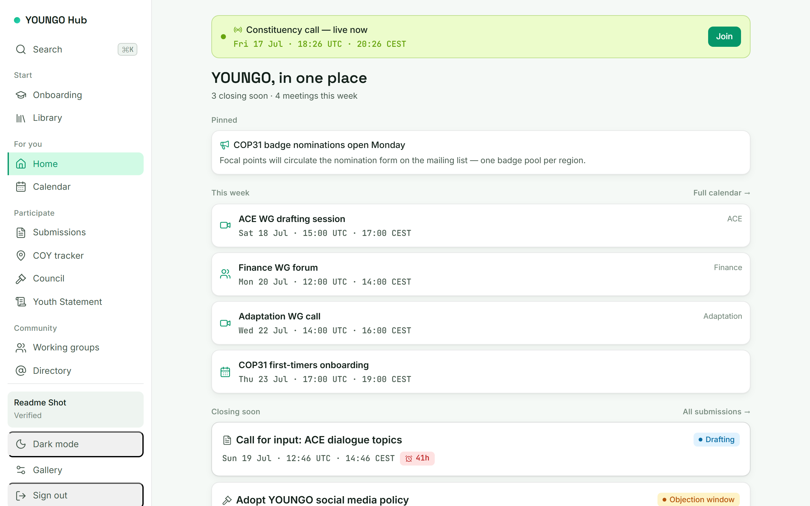

# YOUNGO Hub

**The member OS for the Children & Youth Constituency of the UNFCCC.**

What’s happening · what can I contribute to · where can I go · who do I contact · what is my WG doing · what is being decided — in under 30 seconds.

<p align="center">
  <a href="https://web-staging-31ab.up.railway.app"><strong>Open staging →</strong></a>
  &nbsp;·&nbsp;
  <a href="https://youngoclimate.org/">youngoclimate.org</a>
</p>

<p align="center">
  
</p>
<p align="center"><sub>Home — live constituency call, this week, and closing deadlines</sub></p>

---

## Screenshots

Captured from [staging](https://web-staging-31ab.up.railway.app). Refresh anytime with:

```bash
npm run screenshots   # optional: APP_ORIGIN=https://…
```

| Membership policy gate | Sign in |
| :---: | :---: |
|  |  |

| Onboarding + FAQ (verified) | Working groups |
| :---: | :---: |
|  |  |

| Calendar | Capacity Building library |
| :---: | :---: |
|  |  |

<p align="center">
  
</p>
<p align="center"><sub>Same home feed in light mode</sub></p>

---

## Why this exists

YOUNGO is a **platform and network**, not a single NGO. Work happens across Working Groups, Council processes, COYs, and accredited organisations — usually scattered across WhatsApp, docs, and memory.

**YOUNGO Hub** brings that into one place:

| Surface | Purpose |
| --- | --- |
| **Home feed** | Live meetings, this week, closing deadlines, pinned notes |
| **Calendar** | Constituency + WG calls (ICS subscribe) |
| **Submissions / Council / COYs** | Track opens, decisions, and conferences of youth |
| **Working groups** | Catalog → workspace onboarding → WhatsApp & CPs |
| **Messages** | Verified members can chat with CPs / mandate holders, not arbitrary member-to-member DMs |
| **Onboarding** | Membership policy → account → course → verified member |
| **Library** | Capacity Building guides (open access) |
| **NGO platform** | Deadlines, endorse/submit requests, multi-user seats, contribution points |
| **NGO points** | Staff-awarded points for badge support & UNFCCC submission help (tiers on NGO portal) |
| **Hub Intelligence** | Role-scoped evidence search, extractive synthesis, citations, field policy, and reviewed research notes |
| **Admin** | Members & orgs (never passwords), roles, reset links |

---

## Member journey

```text
  Policy (first browser visit)
            │
            ▼
  Create account  or  Sign in
            │
            ▼
  Membership course + test
            │
            ▼
     ✓ Verified member
            │
     ┌──────┼──────┬────────────┐
     ▼      ▼      ▼            ▼
   Home   WGs   NGO seats    Admin / CP
          workspaces
```

1. **Read the Membership Policy** (mandatory, once per policy version).
2. **Join YOUNGO** — individual or organisation (UNFCCC admitted / non-admitted).
3. **Pass the membership course** — hub unlocks.
4. **Join WG workspaces** — presentation + rules, then channels & contacts.
5. **Message CPs / mandate holders** when you need help or coordination.
6. **Come back to Onboarding anytime** — course review, library, FAQ.

Password reset is built in (forgot-password + one-time links; admin can mint links).

---

## Roles

| Role | Unlocks |
| --- | --- |
| **Member** (verified) | Full hub: feed, calendar, groups, directory… |
| **Focal Point** | Constituency-wide mandate holder: UNFCCC Secretariat representation, mandate-holder coordination, progress overview |
| **WG Contact Point** | `/cp/:wg` — joiners, approve roles, log activities |
| **NGO admin / seat** | `/ngo` — requests, deadlines, invite representatives |
| **Admin** | `/admin` — directory, verify, roles, password reset links |

Admins are promoted from `ADMIN_EMAILS` (comma-separated) on login / bootstrap.

Messaging is intentionally role-aware: verified members can start conversations only with contact points or mandate holders (`focal_point`, `wg_contact`, `ngo_admin`, `admin`, or active WG `contact` / `lead`). Focal Points and other mandate holders can start conversations with each other for shared tasks, UNFCCC-facing coordination, calls, and constituency progress tracking. Once a permitted conversation exists, either participant can reply.

---

## Stack

| Layer | Choice |
| --- | --- |
| UI | React 19 + Vite 8 · **Verdant** design tokens |
| API | Express · same origin as static build on Railway |
| Auth | Email + password (scrypt) · hashed sessions in HttpOnly cookies |
| Data | **Postgres** when `DATABASE_URL` is set · fixtures for local demo content |
| Deploy | Railway (Nixpacks) · `preDeployCommand: npm run migrate` |

```
youngo-hub/
├── src/                 React client (pages, gates, Verdant CSS)
├── server/              Express API (auth, member, public, ICS)
├── migrations/          Postgres schema (001…009+)
├── data/fixtures.json   Demo calendar / WGs / feed content
├── src/content/         Policy, course, WG onboarding copy
├── scripts/             migrate · bootstrap-admin
└── openspec/            Product change queue
```

---

## Quick start

**Requirements:** Node `^20.19 || >=22.12`

```bash
npm install
npm run dev-all     # API :8787 + Vite :5173 (proxied)
```

Open [http://localhost:5173](http://localhost:5173).

```bash
npm test            # node:test
npm run lint
npm run build && npm start   # production-style single process
```

### With Postgres

```bash
export DATABASE_URL=postgres://…
npm run migrate              # applies migrations/*.sql
npm run bootstrap-admin      # optional: seed ADMIN_EMAILS + print reset URLs
```

Without `DATABASE_URL`, accounts fall back to local JSON under `data/` (dev only). Feed content still comes from `fixtures.json` until migrated to Postgres/Calendar API.

### Environment

| Variable | Purpose |
| --- | --- |
| `DATABASE_URL` | Postgres connection (Railway injects this) |
| `APP_ORIGIN` | Required production origin for CORS and reset / invite links |
| `ADMIN_EMAILS` | Comma-separated admins (auto-promote + bootstrap) |
| `PRINT_ADMIN_RESET_URLS` | Emergency opt-in: emit a reset URL only for a newly created bootstrap admin; keep unset during routine deploys |
| `PORT` | HTTP port (Railway injects) |

---

## Staging

| | |
| --- | --- |
| **URL** | https://web-staging-31ab.up.railway.app |
| **Health** | `GET /healthz` → `{ ok, db: "postgres" \| "fixtures" }` |

Deploy (from this package root):

```bash
railway up --environment staging --service web -m "your message"
```

---

## Design system

**Verdant** — colors only live in `src/styles/tokens.css` (light + dark).  
Display: Space Grotesk · UI: Inter · Mono: JetBrains Mono.

Component gallery (dev): `/gallery`.

---

## Product principles

- **Evidence before synthesis:** every Hub Intelligence bullet retains citations and an explicit verification caveat.
- **Source-side privacy:** raw accounts, credentials, sessions, messages, guardian/minority data, and personal account fields stay outside retrieval.
- **Controlled writeback:** cited research notes require idempotent proposal, a different admin's approval, and separate application.

- **Fast orientation** — status, deadlines, and next actions above the fold.
- **Policy-aligned membership** — Network / Constituency Work, age rules, org paths.
- **Gates with purpose** — policy → account → course → WG workspace, not friction for its own sake.
- **Role-aware surfaces** — members, CPs, NGOs, and staff each see the tools they need.
- **No password leakage** — hashes only; reset tokens are single-use and hashed at rest.

---

## Roadmap (high level)

- [x] Membership policy gate & registration (individual + org)
- [x] Course verification & feature lock
- [x] WG workspace onboarding
- [x] NGO seats (invite / accept / revoke)
- [x] Admin directory & password reset
- [x] Member messaging backend (CP / mandate-holder conversations)
- [x] Scoped role assignments and capability-based authorization
- [x] Membership lifecycle states (course, onboarding, activation, renewal, exit)
- [x] GYS contribution review workflow with versioned status history
- [x] Hub Intelligence public/member/mandate/operations evidence scopes
- [x] Citation-first synthesis UI, private-query audit, field-policy denials, and admin metrics
- [x] Independently approved cited research-note writeback
- [x] Governance audit log, expiring NGO invites, and session hardening
- [ ] **Align & update the onboarding process with the YOUNGO Onboarding Taskforce** (course content, verification steps, Membership Team handoff, and official cycles)
- [ ] Live Google Calendar API (owner console access)
- [ ] Full feed content in Postgres (not only fixtures)
- [ ] SMTP for reset / invite emails
- [ ] Richer Capacity Building library & RACI workflows

---

## Contributing

1. Read product context in `openspec/project.md` (and parent `docs/specs/youngo/` when available).
2. Prefer small, shippable slices; keep design tokens centralized.
3. Run `npm test` and `npm run lint` before opening a PR.

---

## Links

- **YOUNGO** — [youngoclimate.org](https://youngoclimate.org/)
- **Membership contact** — membership@youngoclimate.org · youngomembership@gmail.com
- **Staging hub** — [web-staging-31ab.up.railway.app](https://web-staging-31ab.up.railway.app)

---

<p align="center">
  <sub>Built for the constituency · by people who need the calendar to stop living in twelve chats.</sub>
</p>
